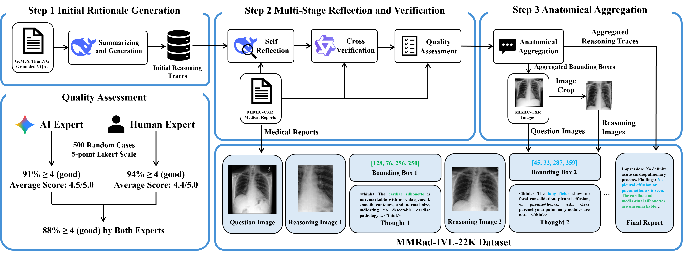

# Thinking like a radiologist

Official code of ''Thinking Like a Radiologist: A Dataset for Anatomy-Guided Interleaved Vision Language Reasoning in Chest X-ray Interpretation''

  📤 <a href="https://github.com/qiuzyc/thinking_like_a_radiologist" target="_self">Get Started</a> &nbsp; | &nbsp;
  📄 <a href="https://github.com/qiuzyc/thinking_like_a_radiologist" target="_blank">Preprint</a> &nbsp; | &nbsp;
  🤗 <a href="https://github.com/qiuzyc/thinking_like_a_radiologist" target="_blank">Dataset</a>

## TODO 
- [ ] Release training codes
- [ ] Release a subset of MMRad-IVL dataset
- [ ] Release full MMRad-IVL dataset

## Acknowledgements
- [GeMeX-ThinkVG](https://huggingface.co/datasets/BoKelvin/GEMeX-ThinkVG)
- [Anole-Zebra-CoT](https://huggingface.co/multimodal-reasoning-lab/Anole-Zebra-CoT)
- [Thinking with Generated Images](https://github.com/GAIR-NLP/thinking-with-generated-images)
